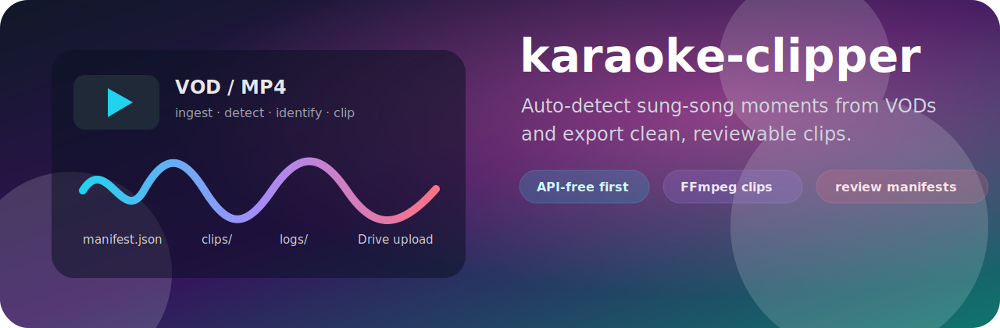
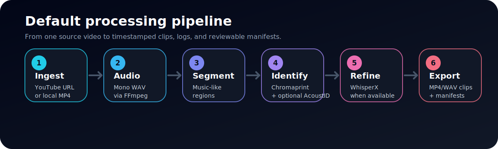
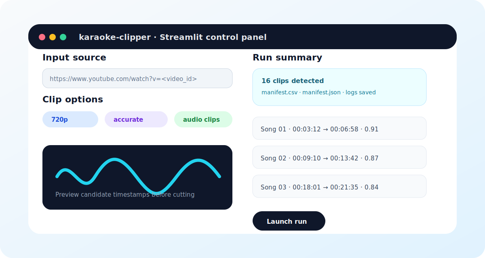
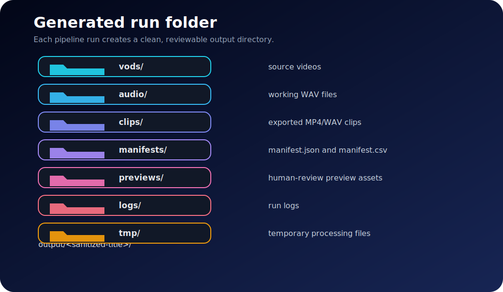

<p align="center">
  
</p>

<h1 align="center">karaoke-clipper</h1>

<p align="center">
  <strong>Auto-detect likely sung-song segments from a YouTube VOD or local MP4, clip them, and generate reviewable manifests.</strong>
</p>

<p align="center">
  
  
  
  
</p>

---

## Table of contents

- [Why this project exists](#why-this-project-exists)
- [Core features](#core-features)
- [How it works](#how-it-works)
- [Quick start](#quick-start)
- [Run examples](#run-examples)
- [Streamlit UI](#streamlit-ui)
- [Google Drive upload](#google-drive-upload)
- [CLI reference](#cli-reference)
- [Output layout](#output-layout)
- [Repository layout](#repository-layout)
- [Tests and Docker](#tests-and-docker)
- [Working status, fallbacks, and limitations](#working-status-fallbacks-and-limitations)
- [Future improvements](#future-improvements)

---

## Why this project exists

`karaoke-clipper` is a pragmatic MVP for turning long VODs into short, reviewable karaoke or sung-song clips. It supports both YouTube URLs and local MP4 files, then produces exported clips, manifests, logs, and optional Google Drive uploads.

The project is designed to be **API-free first**: local Chromaprint matching can work without paid APIs, while optional AcoustID integration stays isolated behind a backend interface.

## Core features

| Area | What it does |
|---|---|
| Input | Accepts a YouTube URL via `yt-dlp` or a local MP4 file. |
| Audio preprocessing | Extracts a mono working WAV with FFmpeg. |
| Segment detection | Detects music-like regions using `inaSpeechSegmenter`, with an energy-based fallback. |
| Identification | Matches candidate segments against a local Chromaprint reference library. |
| Optional lookup | Uses AcoustID only when enabled and configured. |
| Boundary refinement | Uses WhisperX when installed; otherwise keeps coarse boundaries. |
| Export | Writes MP4 clips, optional WAV clips, `manifest.json`, `manifest.csv`, logs, and review assets. |
| UI | Provides a local Streamlit control panel for parameter entry and timestamp preview. |

## How it works

<p align="center">
  
</p>

Default flow:

1. Ingest source with `yt-dlp` URL mode or local file mode.
2. Extract a mono working WAV with FFmpeg.
3. Detect music-like candidate regions using `inaSpeechSegmenter` or fallback energy segmentation.
4. Match segments using a local Chromaprint library.
5. Optionally call AcoustID when enabled and available.
6. Refine boundaries with WhisperX when installed.
7. Cut clips with FFmpeg and write manifests.

## Quick start

### 1. Install prerequisites

Make sure these tools are available on your machine:

| Requirement | Purpose |
|---|---|
| Python 3.10+ | Runtime environment. |
| FFmpeg / FFprobe | Audio extraction and clip cutting. |
| Chromaprint / `fpcalc` | Local audio fingerprint matching. |

### 2. Set up the base environment

```bash
make setup
```

### 3. Optional: install the ML stack

Use this when you want stronger segmentation and WhisperX-based refinement.

```bash
# Windows
.venv/Scripts/python -m pip install -r requirements-ml.txt

# macOS / Linux
.venv/bin/python -m pip install -r requirements-ml.txt
```

> Optional ML extras such as `inaSpeechSegmenter` and `whisperx` may require a Python version that supports TensorFlow wheels. Python 3.9–3.12 is recommended for those extras.

### 4. Build a local fingerprint library

```bash
python scripts/build_reference_library.py \
  --input-dir data/reference_songs \
  --output data/reference_library.json
```

Supported filename convention:

```text
Artist - Song.wav
```

## Run examples

### YouTube URL mode

```bash
python -m app.main \
  --url "https://www.youtube.com/watch?v=<video_id>" \
  --outdir output \
  --audio-clips true \
  --use-acoustid false \
  --ref-library data/reference_library.json \
  --device cpu \
  --clip-resolution 720p \
  --expected-song-count 16
```

### Local file mode

```bash
python -m app.main \
  --file "C:/videos/sample.mp4" \
  --outdir output \
  --audio-clips false \
  --use-acoustid false \
  --ref-library data/reference_library.json \
  --device cpu \
  --clip-resolution source
```

### Makefile shortcuts

```bash
make run-url URL="https://www.youtube.com/watch?v=<video_id>"
make run-file FILE="C:/videos/sample.mp4"
```

### Batch mode

```bash
python scripts/batch_run.py \
  --input data/batch_sources.txt \
  --outdir output/batch \
  --ref-library data/reference_library.json
```

### Batch mode with segment tuning

```bash
python scripts/batch_run.py \
  --input data/batch_sources.txt \
  --outdir output/batch \
  --min-segment 60 \
  --max-segment 420 \
  --merge-gap 3.5 \
  --expected-song-count 16
```

## Streamlit UI

<p align="center">
  
</p>

Run the local UI to enter parameters, preview timestamps, and launch the pipeline:

```bash
streamlit run app/ui/streamlit_app.py
```

On Windows, use `run_streamlit_chrome.bat` if you want the app to open in Chrome instead of the system default browser.

## Google Drive upload

Set the folder ID in `.env` or pass it via CLI.

```env
GDRIVE_FOLDER_ID=your_folder_id
GDRIVE_CLIENT_SECRETS=secret/client_secret.json
GDRIVE_TOKEN=secret/token.json
```

Notes:

- The app accepts either a raw folder ID or a full Google Drive folder URL and extracts the folder ID.
- By default, the pipeline uploads only the `clips/` folder to Drive.
- To upload the entire run folder, use the Streamlit **Upload mode** control or the CLI flag:

```bash
--gdrive-upload-mode all
```

## CLI reference

| Flag | Description |
|---|---|
| `--url <youtube_url>` | YouTube VOD input. |
| `--file <local_mp4>` | Local MP4 input. |
| `--outdir <path>` | Parent output directory. Each run creates a sanitized `<title>` subfolder. |
| `--audio-clips true\|false` | Export WAV clips in addition to MP4 clips. |
| `--min-segment <seconds>` | Minimum candidate segment duration. |
| `--max-segment <seconds>` | Maximum candidate segment duration. |
| `--use-acoustid true\|false` | Enable optional AcoustID lookup. |
| `--ref-library <path>` | Path to local Chromaprint reference library. |
| `--device cpu\|cuda` | Compute device for optional ML steps. |
| `--sample-rate <hz>` | Working audio sample rate. |
| `--clip-resolution source\|1080p\|720p\|480p\|360p` | Output clip resolution preset. |
| `--clip-mode accurate\|fast` | Clip cutting mode. |
| `--expected-song-count <int>` | Merge hint to reduce over-splitting. |
| `--merge-gap <seconds>` | Pause threshold for merging neighboring segments. |
| `--fingerprint-threshold <0-1>` | Local matching confidence threshold. |
| `--gdrive-upload true\|false` | Enable Google Drive upload. |
| `--gdrive-folder-id <id>` | Target Drive folder ID or URL. |
| `--gdrive-client-secrets <path>` | OAuth client secrets path. |
| `--gdrive-token <path>` | OAuth token path. |
| `--gdrive-include-tmp true\|false` | Include temporary files in Drive upload when applicable. |

Additional behavior:

- `--clip-resolution source` keeps the original resolution.
- Fixed presets such as `720p` and `1080p` re-encode clip video and preserve aspect ratio with padding when needed.
- If `--clip-mode fast` is combined with a fixed resolution preset, clipping automatically switches to accurate mode for that clip.
- `--expected-song-count` coalesces nearest neighboring segments toward your target count.
- If the finalized clip count is still higher than expected, increase `--merge-gap`, for example `--merge-gap 3.5`.
- Google Drive upload uses OAuth user login and stores a token at `secret/token.json` by default.

## Output layout

<p align="center">
  
</p>

```text
output/
  <title>/
    vods/
    audio/
    clips/
    manifests/
    previews/
    logs/
    tmp/
```

Manifest fields include:

| Field | Meaning |
|---|---|
| `source_video` | Original video source path. |
| `video_id` | YouTube video ID when available. |
| `song` | Matched song title. |
| `artist` | Matched artist. |
| `start_sec` / `end_sec` | Numeric clip boundaries in seconds. |
| `start_tc` / `end_tc` | Human-readable timecodes. |
| `confidence` | Matching confidence score. |
| `clip_path` | Exported MP4 clip path. |
| `audio_path` | Optional WAV clip path. |
| `backend` | Identification backend used. |

## Repository layout

```text
app/
  main.py                         # CLI + orchestration
  config.py                       # CLI/runtime config
  ingest/youtube.py               # URL download + local source registration
  preprocess/extract_audio.py     # working audio extraction
  segment/music_segments.py       # segmentation + merge logic
  identify/chromaprint_match.py   # local fingerprint matching
  identify/acoustid_client.py     # optional AcoustID backend
  align/whisperx_align.py         # timestamp refinement
  clip/cutter.py                  # clip export
  output/manifest.py              # manifest writers
scripts/
  build_reference_library.py      # build local fingerprint index
  batch_run.py                    # batch processing entry point
tests/                            # unit tests
```

## Tests and Docker

### Run unit tests

```bash
make test
```

Covered areas:

- Timecode conversion.
- Manifest writer behavior.
- Segment merge logic.

### Docker CPU build

```bash
make docker-build
make docker-run
```

## Working status, fallbacks, and limitations

### Fully working in this MVP

| Capability | Status |
|---|---|
| URL/local ingest | Working. |
| Working audio extraction | Working. |
| Candidate segmentation | Working with fallback if `inaSpeechSegmenter` is missing. |
| Local fingerprint matching | Working when `pyacoustid` and `fpcalc` are installed. |
| Clip export and manifest writing | Working. |
| Logging and retry-safe URL download | Working. |

### Fallback or stubbed behavior

| Situation | Behavior |
|---|---|
| `inaSpeechSegmenter` is not installed | Falls back to energy segmentation. |
| `whisperx` is not installed | Boundary refinement returns coarse timestamps. |
| `--use-acoustid true` but key/package is unavailable | AcoustID backend is skipped safely. |

### Limitations

- Fingerprint matching quality depends on reference library coverage.
- Live streams with heavy speech-over-music may reduce detection quality.
- WhisperX refinement quality depends on model availability and compute.

## Future improvements

- Add a stronger music/noise classifier and score calibration.
- Add confidence fusion across segmentation, fingerprint matching, and transcript cues.
- Add a richer report UI for human review.
- Add visual review pages that pair waveform previews with candidate clip metadata.
- Add preset profiles for karaoke streams, concerts, podcasts, and mixed talk/music VODs.

---

<p align="center">
  Built for fast review loops: detect → clip → inspect → upload.
</p>
